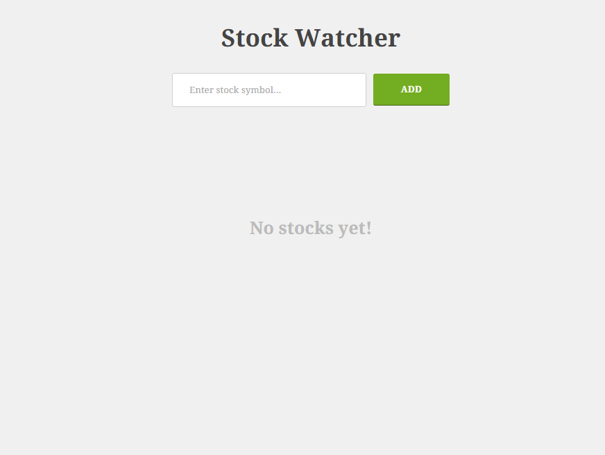
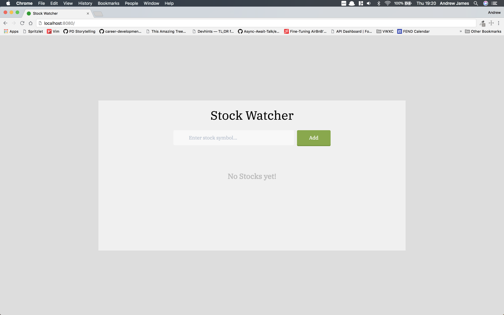
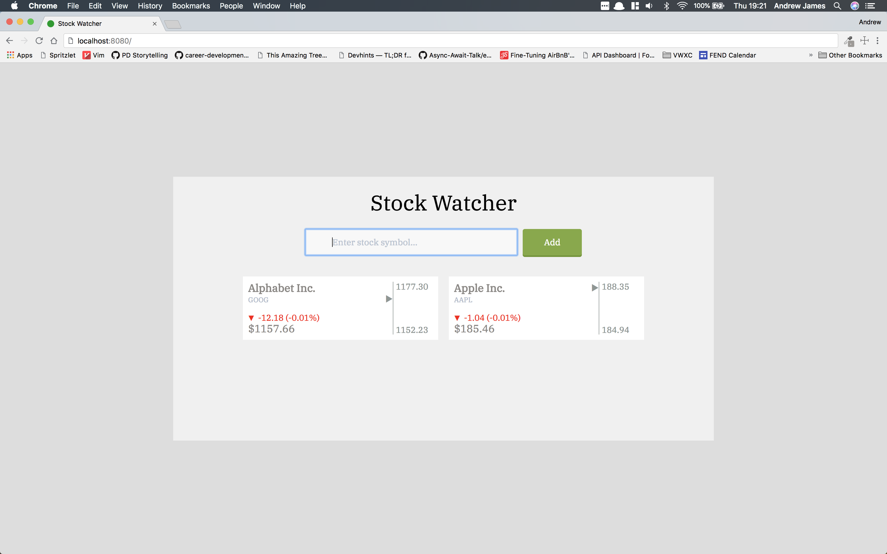
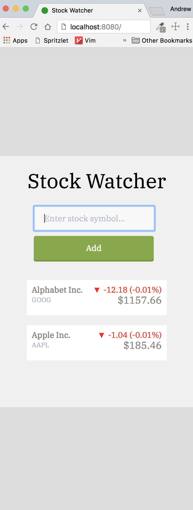

# Take Home Stock Watcher

### View the project live

[Stock Watcher](https://stock-watcher.surge.sh)

### Steps to run project
**You can use npm or Yarn. I am using yarn in the example**

1. Clone this repo  https://github.com/andrew-t-james/StockWatcher

2. `cd` into directory

3.
```
$ yarn install
$ yarn run dev-server
```

4. Navigate to  `http://localhost:8080`


### Steps to run Test Suite

```
$ yarn test
```

The results of the test suite will show up in terminal.

#### Original Design


#### Recreation Design

**Large Screen no Stock Quotes**


**Large with Stock Quotes**


**MobileScreen no Stock Quotes**


